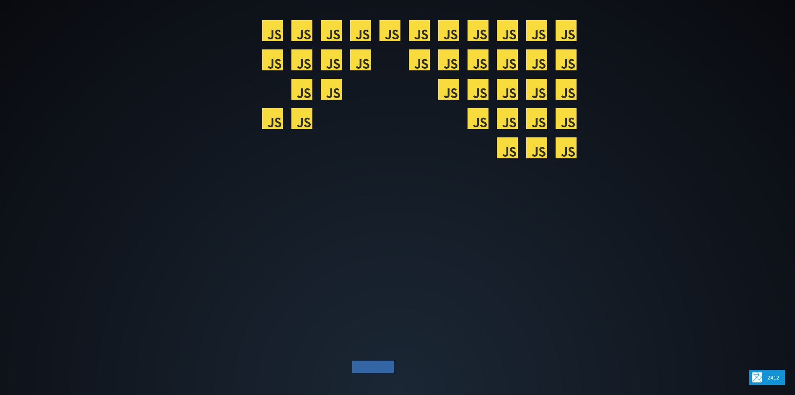

# Lang Invaders

A space invaders clone written in [Elm](http://elm-lang.org/). The twist is that the enemies are programming languages.

## Screenshot

## Technologies used

- [Elm](http://elm-lang.org/)
- [Vite](https://vitejs.dev/)
- [Elm Canvas](https://package.elm-lang.org/packages/joakin/elm-canvas/latest/)
- [Elm Color](https://package.elm-lang.org/packages/avh4/elm-color/latest/)

## Todo

- Play sound effects
  - on collision
  - on shooting
- Add a game over screen
- Add a start screen
  - The user will choose the language to kill 😂
- Score Display
- More languages
